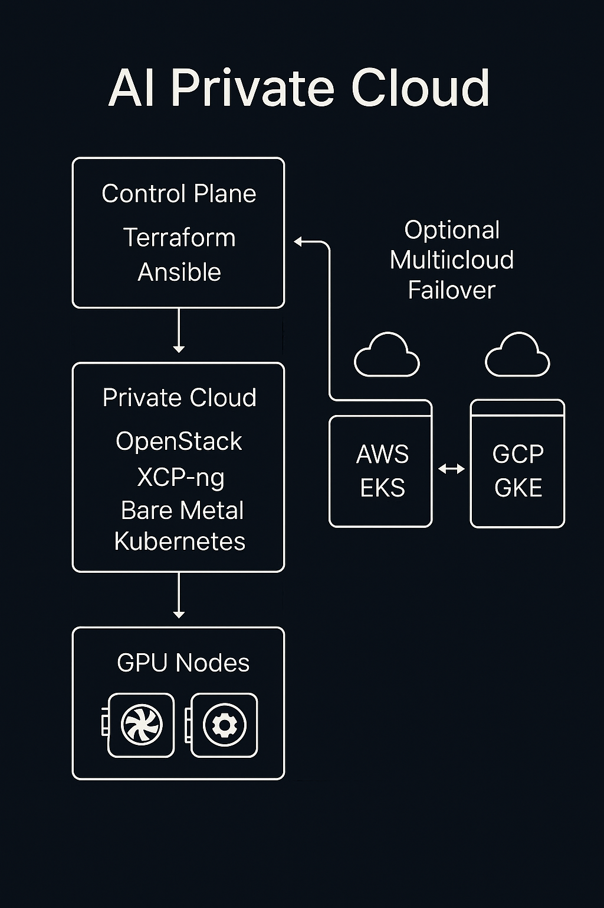

# AI Private Cloud Showcase

This repository is the **public showcase** for the private project at `gravitasse/ai-private-cloud`.  
It provides architecture diagrams, key design summaries, and a recruiter-safe description of the platform.

---

## 🚀 AI Private Cloud Multi-Cloud Failover Platform

This project demonstrates a **private AI cloud** architecture for **inference and training workloads**, supporting **multi-cloud redundancy**, **GPU acceleration**, and **Ollama-based LLM deployments** on Kubernetes.

### Key Capabilities
- 🧩 **Terraform + Ansible** – full-stack Infrastructure-as-Code automation  
- ☁️ **AWS (Primary)** & **GCP (Secondary)** – DNS-based failover (Route 53 health checks)  
- 🎛️ **Kubernetes GPU clusters** – optimized for AI/ML (NVIDIA + Intel support)  
- 🧠 **Ollama integration** – self-hosted LLM inference inside the private cluster  
- 🔄 **Model / artifact sync** – replication between clouds for seamless failover  
- 📊 **Observability** – Prometheus / Grafana / Loki pattern for monitoring  

---

## 🧱 Architecture Visuals

| AI Private Cloud Topology | Multi-Cloud Failover |
|---------------------------|----------------------|
|  |  |

---

## 💡 Use Cases
- Private AI inference & LLM serving with **data sovereignty**  
- Hybrid (on-prem + cloud) model training pipelines  
- Zero-downtime **multi-cloud** AI infrastructure  
- Self-hosted **Ollama**, **LM Studio**, **Open WebUI** clusters  

---

## 🔗 Related
- Full private codebase: `gravitasse/ai-private-cloud` (private)
- Public diagrams & examples: **this repo**

## Repository Layout (Infra Snapshot)

This repo also includes the skeletal infrastructure code behind the diagrams:

- `terraform/` – HCL modules and environments:
  - `modules/network`, `modules/k8s-cluster`
  - `envs/dev/aws` plus examples for OpenStack and inventory templating
- `ansible/` – inventories, playbooks, and roles:
  - `bootstrap`, `k8s-cluster`, `gpu-nodes`, `site.yml`
  - roles for base OS, GPU nodes (Intel/NVIDIA), k8s control-plane/worker nodes, and platform apps
- `tools/docker/` – dev container definition for a reproducible Terraform/Ansible CLI environment
- `Makefile` – helper targets for running Terraform and Ansible locally or inside the dev container

Legacy diagrams (v1)

| AI Private Cloud Topology (v1) | Multi-Cloud Failover (v1) |
|--------------------------------|---------------------------|
|  |  |

