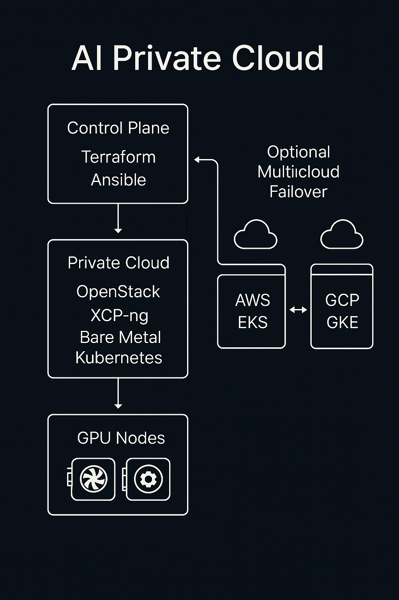
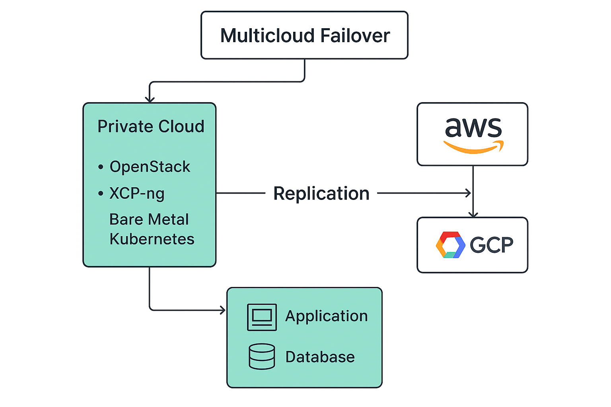

# AI Private Cloud Showcase

This repository is the **public showcase** for the private project at `gravitasse/ai-private-cloud`.  
It provides architecture diagrams, key design summaries, and a recruiter-safe description of the platform.

---

## 🚀 AI Private Cloud Multi-Cloud Failover Platform

This project demonstrates a **private AI cloud** architecture for **inference and training workloads**, supporting **multi-cloud redundancy**, **GPU acceleration**, and **Ollama-based LLM deployments** on Kubernetes.

### Key Capabilities

- 🧩 **Terraform + Ansible** – full-stack Infrastructure-as-Code automation
- ☁️ **AWS (Primary)** & **GCP (Secondary)** – Automated Route 53 DNS Failover
- 🎛️ **Kubernetes GPU clusters** – optimized for AI/ML (NVIDIA + Intel/Gaudi support)
- 🧠 **Ollama & Open WebUI** – self-hosted LLM inference and RAG interface
- 🔄 **Modular Storage Layer** – pluggable architecture supporting Longhorn, OpenEBS, and AWS FSx
- 🛡️ **Zero-Trust Hardening** – AWS SSM secure access with strictly private subnets
- 🚀 **VPS Docker Edition** – a lightweight "AI Cloud in a Box" using Docker Compose
- 🐧 **Multi-Platform Ansible** – Debian/Ubuntu, RedHat/Rocky/Alma, macOS, Windows, and container-safe roles

---

## 🧱 Architecture Visuals

| AI Private Cloud Topology | Multi-Cloud Failover |
|---------------------------|----------------------|
|  |  |

---

## 💡 Use Cases
- Private AI inference & LLM serving with **data sovereignty**  
- Zero-downtime **multi-cloud** AI infrastructure via Route 53 Load Balancing  
- Agnostic Enterprise Storage using Longhorn or OpenEBS  
- Self-hosted **Ollama**, **n8n**, and **Open WebUI** clusters  

---

## 🔗 Related
- Full private codebase: `gravitasse/ai-private-cloud` (private)
- Public diagrams & examples: **this repo**

## Repository Layout (Infra Snapshot)

This repo also includes the skeletal infrastructure code behind the diagrams:

- `terraform/` – HCL modules and environments:
  - `modules/network`, `modules/k8s-cluster`, `modules/global-routing`
  - `envs/dev/aws` plus examples for OpenStack and inventory templating
- `ansible/` – modular inventories, playbooks, and roles:
  - `storage-longhorn`, `storage-openebs`, `storage-aws-fsx`
  - roles for base OS, GPU nodes (NVIDIA + Intel/Gaudi), k8s control-plane/worker nodes, and platform apps
  - all roles support Debian/Ubuntu, RedHat/Rocky/Alma, and macOS/Windows noop guards
  - FQCN (`ansible.builtin.*`) throughout; lint-clean at `ansible-lint` production profile
  - Cilium CNI installed via Helm (v1.16.6); k8s packages from `pkgs.k8s.io/core:/stable:/v1.32`
- `vps-docker/` – The "AI Cloud in a Box" Docker Compose stack (Ollama + WebUI + n8n)
- `Makefile` – helper targets for running Terraform and Ansible locally

Legacy diagrams (v1)

| AI Private Cloud Topology (v1) | Multi-Cloud Failover (v1) |
|--------------------------------|---------------------------|
|  |  |

